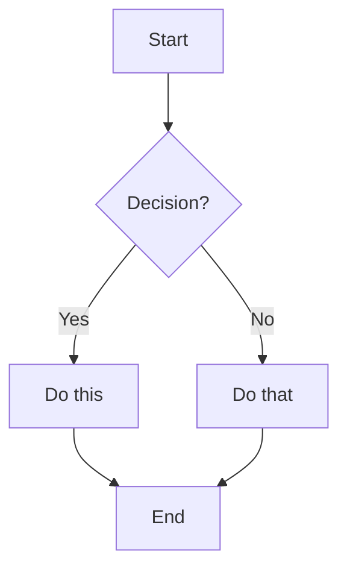
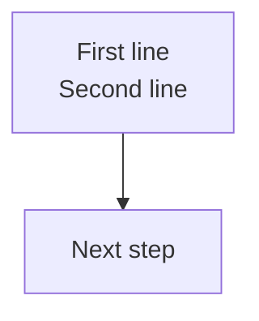
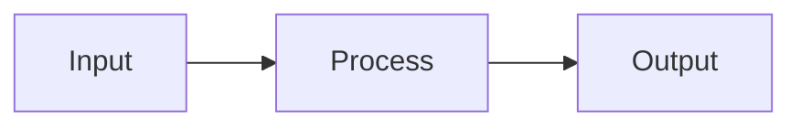
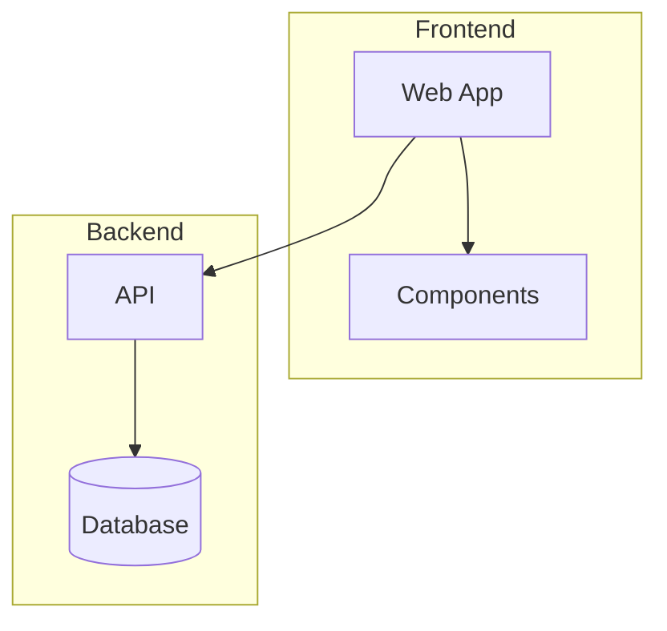
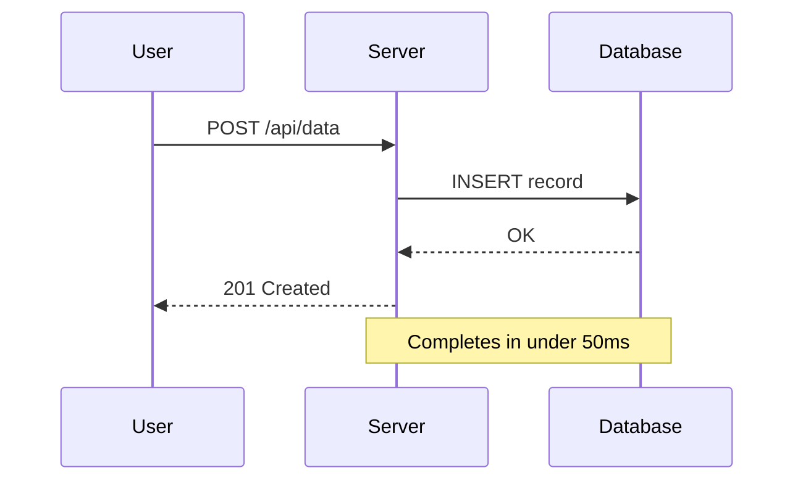
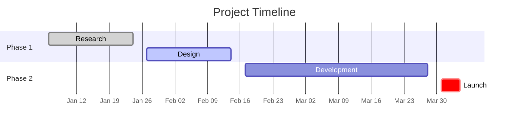
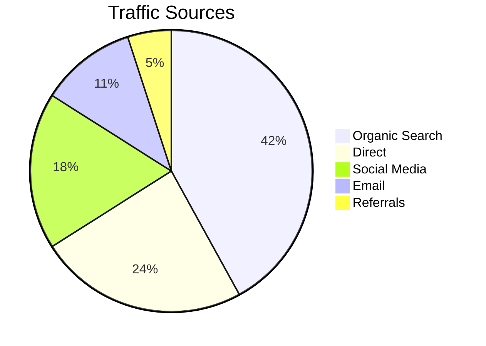
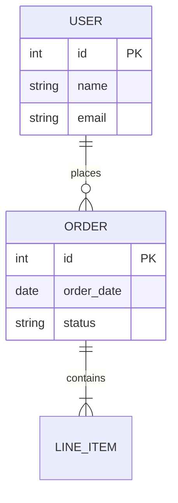
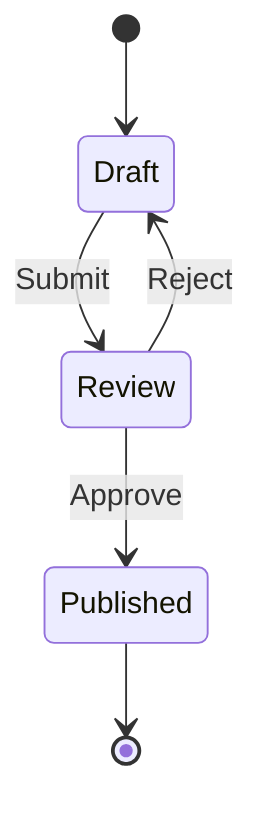
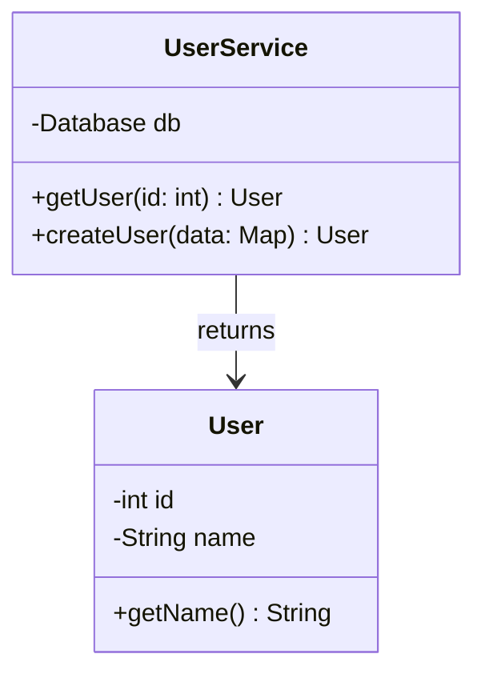

# Carbon Slides

Write presentations in **plain Markdown**. Render them as polished, scrolling
slide decks on **GitHub Pages**, styled with IBM's
[Carbon Design System](https://carbondesignsystem.com/) tokens.

No build step. No npm install. No static site generator. Just two files.

```
slides.md   -->   index.html   -->   GitHub Pages
 (you write)      (template)         (renders it)
```


## Quick Start

1. **Clone or fork this repo.**

2. **Edit `slides.md`** with your own content. To add a logo, place an image
   file in `./images/` and add `` to the title
   slide section. Everything is configured in this one file.

3. **Enable GitHub Pages** in your repo settings:
   - Go to **Settings > Pages**
   - Under "Source", select **Deploy from a branch**
   - Choose `main` (or `master`) and `/ (root)`
   - Click **Save**

4. **Visit** `https://YOUR-USERNAME.github.io/YOUR-REPO-NAME/`

Your slides are live. To update them, edit `slides.md` and push.


## File Structure

```
your-repo/
  index.html      # Rendering template (rarely needs editing)
  slides.md       # Your slides (edit this for every talk)
  images/         # Any images referenced in your slides
    logo.png      # Company or project logo (shown on title slide)
    chart.png
    photo.jpg
  README.md       # This file
```


## How It Works

The `index.html` template runs entirely in the browser. When a visitor loads
your GitHub Pages URL, it:

1. Fetches `slides.md` using `fetch()`
2. Splits the content on `---` horizontal rule separators
3. Parses each section from Markdown to HTML using marked.js
4. Applies Carbon Design System styling via CSS custom properties
5. Renders Mermaid diagram blocks into inline SVGs
6. Applies syntax highlighting to fenced code blocks using Prism.js
7. Extracts the title slide blockquote to generate a per-slide footer
8. Inserts the logo on the title slide (if configured)

The result is a vertically scrolling page where each slide section is visually
separated, typeset in IBM Plex fonts, and styled with Carbon's color tokens,
spacing scale, and component conventions.


## Writing Slides

### Slide separators

Every slide is separated by `---` on its own line, with blank lines above and
below. This is the most important convention:

```markdown
Content for one slide goes here.

---

## Next Slide Title

Content for the next slide.
```

### Title slide

The first section (before the first `---`) is automatically styled as a title
slide with larger, lighter typography. Use this structure:

```markdown
# Your Deck Title
### A subtitle or one-liner


> Your Name -- Date -- Event
```

Any image in the title slide is automatically styled as a logo (capped at
48px height). The logo is optional -- just omit the image line if you don't
need one.

The blockquote line (`> Your Name -- Date`) serves double duty: it appears on
the title slide as presenter information, and the template automatically
extracts it to generate a consistent footer on every subsequent slide. Whatever
you write in this line is what appears in the footer, verbatim. If you change
the presenter, date, or event name, the footer updates everywhere
automatically.

If you omit the blockquote, no footer is generated and slides render without one.

### Slide titles

Every slide after the title should begin with a `##` heading:

```markdown
---

## This Is a Slide Title

Your content goes here.
```


## Supported Markdown Elements

### Headings

| Level | Syntax | Usage | Styling |
|-------|--------|-------|---------|
| `#` | `# Title` | Deck title, once per file | 54px, weight 300 (expressive) |
| `##` | `## Slide Title` | One per slide, always first | 32px, weight 300 (expressive) |
| `###` | `### Sub-heading` | Divide a slide into sections | 20px, weight 600 |

Never go deeper than `###` in a slide deck. If you need that much nesting, the
slide should be split into multiple slides.

### Text formatting

```markdown
This is a plain paragraph. Keep body text concise on slides.

Use **bold** for key terms. Carbon renders this as semibold (weight 600).

Use *italic* for secondary emphasis or attributions.

Use `inline code` for technical terms, file names, and commands.

Combine them: ***bold italic***, **`bold code`**, *`italic code`*.
```

### Unordered lists

```markdown
- First point
- Second point with **bold emphasis**
- Third point mentioning `technical-term`
  - Nested child point
    - Grandchild (three levels max)
```

### Ordered lists

```markdown
1. First step
2. Second step
   1. Sub-step A
   2. Sub-step B
3. Third step
```

### Mixed lists

Ordered and unordered lists can be nested inside each other:

```markdown
- Category one
  1. Specific item
  2. Another item
- Category two
  1. Specific item
```

### Task lists

Use checkbox syntax for progress tracking, checklists, and status boards:

```markdown
- [x] Completed item (renders as filled blue checkbox)
- [x] Another done item
- [ ] Pending item (renders as empty bordered checkbox)
- [ ] Another pending item
```

Task lists are styled to match Carbon's checkbox component: 16px square boxes,
`$interactive` blue fill when checked, with a white checkmark.

### Blockquotes

Blockquotes render as Carbon-style callout boxes with a blue left border and
gray background. Use them for key takeaways, memorable quotes, or summary
statements:

```markdown
> This is a callout. Place it at the end of a slide for maximum impact.
```

Formatting works inside blockquotes:

```markdown
> You can use **bold**, *italic*, and `code` inside a blockquote.
```

### Tables

Tables are styled with Carbon's data table treatment: uppercase headers,
subtle row borders, and hover highlighting.

**Simple table:**

```markdown
| Name       | Role              | Location      |
|------------|-------------------|---------------|
| Alice Chen | Engineering Lead  | San Francisco |
| Bob Patel  | Product Manager   | New York      |
```

**Right-aligned numeric data:**

```markdown
| Quarter | Revenue | Margin |
|---------|--------:|-------:|
| Q1 2025 | $2.4M   | 25.0%  |
| Q2 2025 | $2.9M   | 34.5%  |
```

**Comparison layout** (use tables as two-column layouts):

```markdown
| Before                       | After                          |
|------------------------------|--------------------------------|
| Manual deploys, twice weekly | Automated CI/CD, on every merge|
| 45-minute rollback           | 30-second rollback             |
```

### Code blocks

Fenced code blocks render in IBM Plex Mono with syntax highlighting powered
by Prism.js. The color theme is custom-built from Carbon's palette:

- **Comments** -- muted gray, italic
- **Keywords** -- red (Red 70)
- **Strings** -- green (`$support-success`)
- **Numbers/constants** -- blue (`$interactive`)
- **Functions/class names** -- deep blue (Blue 70)
- **Operators/variables** -- purple (Purple 70)

All colors have dark-theme counterparts that activate automatically when the
theme is toggled.

Include a language tag after the opening backticks for proper highlighting:

````markdown
```python
def hello(name):
    return f"Hello, {name}!"
```
````

Supported languages include (but are not limited to): `python`, `javascript`,
`typescript`, `bash`, `shell`, `css`, `html`, `json`, `yaml`, `sql`, `java`,
`c`, `cpp`, `csharp`, `go`, `rust`, `ruby`, `php`, `swift`, `kotlin`, `r`,
`markdown`, `diff`, `docker`, `graphql`, `toml`, and `xml`. Prism's autoloader
fetches additional language grammars on demand, so most languages work without
any configuration.

### Images

Place image files in an `images/` folder in your repo and reference them with
standard Markdown syntax:

```markdown

```

Images render at full width (capped at 100% of the content area) with Carbon
spacing above and below.

**Images with captions:** Place an italic line immediately after the image:

```markdown


*Figure 1: System architecture. The API gateway routes to three services.*
```

The caption renders in a smaller size with secondary text color.

### Links

```markdown
Visit the [Carbon Design System](https://carbondesignsystem.com/) for details.
```

Links render in Carbon's interactive blue (`$interactive`) with visited links
in purple. In PDF export, URLs are appended in parentheses after the link text
so they remain useful on paper.

### Speaker notes

HTML comments are invisible in the rendered output but visible when editing
the raw `.md` file. Use them for talking points and timing cues:

```markdown
## My Slide

- Key point one
- Key point two

<!-- NOTES: Pause here. Ask the audience if they've encountered this. -->
```

You can include multiple comment blocks per slide.


## Supported Mermaid Diagrams

Mermaid blocks are fenced code blocks with the `mermaid` language tag. The
template renders them as inline SVGs using Mermaid.js, with colors mapped to
Carbon's design tokens for both light and dark themes.

### Flowchart (top-down)

Decision trees, process flows, and branching logic:

````markdown

````

Use `<br/>` for line breaks inside node labels (not `\n`):

````markdown

````

### Flowchart (left-to-right)

Pipelines, horizontal processes, and data flows:

````markdown

````

### Flowchart with subgraphs

Group related nodes into labeled clusters:

````markdown

````

### Sequence diagram

Interactions between actors over time:

````markdown

````

### Gantt chart

Project timelines and phased rollouts:

````markdown

````

Task states: `done` (completed), `active` (in progress), `crit` (critical),
and `milestone` (zero-duration marker).

### Pie chart

Proportional data:

````markdown

````

### Entity-relationship diagram

Data models and database schemas:

````markdown

````

### State diagram

Lifecycle and status transitions:

````markdown

````

### Class diagram

Object-oriented design and API structure:

````markdown

````


## Features

### Per-slide footer

The template automatically generates a footer on every slide except the title
slide. The footer text is pulled directly from the blockquote on your title
slide (the `> Your Name -- Date` line), so there is nothing extra to configure
in the Markdown. The left side shows the footer text and the right side shows
the slide number (e.g., "5 / 28").

The footer uses 12px secondary-colored text with a subtle top border, keeping
it visually quiet so it never competes with slide content. It renders in PDF
exports and stays attached to its slide across page breaks.

To change the footer content, edit the blockquote on your title slide:

```markdown
> Jim Weaver -- March 2026
```

or with more context:

```markdown
> Jim Weaver -- March 2026 -- Acme Corp Internal
```

To remove footers entirely, delete the blockquote from the title slide.

### Title slide logo

Add a standard Markdown image to your title slide section in `slides.md`:

```markdown
# Your Deck Title
### Subtitle


> Your Name -- Date
```

Any image in the title slide is automatically styled as a logo: capped at
3rem (48px) height, displayed as a block element with appropriate spacing.
No configuration in `index.html` is needed. The logo placement is flexible --
it can go before the title, between the title and subtitle, or between the
subtitle and the presenter line. The most common placement is between the
subtitle and the presenter line, or above the title.

To remove the logo, delete the image line from the title slide. To change
the logo for a different talk, change the image path.

Supported image formats include PNG, SVG, JPG, and GIF. SVG is recommended
for logos because it stays sharp at any display resolution and in PDF exports.

### Dark / light theme toggle

Click the **Theme** button in the navigation bar to switch between Carbon's
White theme and Gray 100 (dark) theme. All text, backgrounds, borders, tables,
blockquotes, code highlighting, and Mermaid diagrams update automatically
because everything references CSS custom properties.

### PDF export

Click the **PDF** button in the navigation bar. This opens the browser's
native print dialog where you select "Save as PDF" as the destination.

The print stylesheet:

- Puts each slide on its own page (`page-break-after: always`)
- Prevents images, tables, code blocks, and diagrams from splitting across pages
- Hides the nav bar and footer
- Forces light-theme colors (even if you're viewing in dark mode)
- Appends URLs after link text so links are useful on paper

**Tip:** In the print dialog, set margins to "Default" or "Minimum" and check
"Background graphics" (in Chrome) so table headers and blockquote backgrounds
render properly.

### Slide counter

The navigation bar shows a scroll-tracking counter (e.g., "5 / 28") that
updates as you scroll through the deck, using IntersectionObserver.

### Responsive layout

The template works on mobile and tablet. Heading sizes scale down on screens
narrower than 672px. The content area is capped at 52rem (832px) for optimal
reading measure on wide screens.

### Embedded fallback

The `index.html` file includes the slide content as an embedded string, so
it renders even when `fetch()` can't load `slides.md` (for example, when
previewing the HTML file locally without a server). On GitHub Pages, the
fetch succeeds and the embedded content is ignored.


## What Carbon Provides

The template applies these Carbon Design System conventions:

| Design element       | Implementation                                          |
|----------------------|---------------------------------------------------------|
| Fonts                | IBM Plex Sans and IBM Plex Mono via Google Fonts CDN    |
| Color tokens         | White theme and Gray 100 dark theme as CSS properties   |
| Spacing scale        | 2-4-8 pixel progression (`--cds-spacing-01` to `-09`)   |
| Type scale           | Expressive headings (light weight at large sizes)       |
| Data tables          | Uppercase headers, hover rows, subtle borders           |
| Blockquotes          | Blue left border with gray background fill              |
| Code blocks          | Carbon-palette syntax highlighting, IBM Plex Mono       |
| Task lists           | Carbon checkbox styling (blue fill, white checkmark)    |
| Mermaid diagrams     | Carbon token colors for nodes, edges, and backgrounds   |
| UI Shell nav bar     | Sticky dark header matching Carbon's shell component    |
| Per-slide footer     | 12px secondary text, auto-generated from title metadata |
| Title slide logo     | Markdown image in title slide, auto-styled to 48px     |


## Customization

### Changing the slides file

Edit the `SLIDES_FILE` variable near the top of the `<script>` in `index.html`:

```javascript
var SLIDES_FILE = 'my-other-talk.md';
```

### Changing the logo

Edit the image line in the title slide section of `slides.md`:

```markdown

```

To remove the logo, delete the image line. Everything is in the Markdown --
no changes to `index.html` are needed.

### Changing the footer

The footer is controlled entirely by the blockquote on your title slide. Edit
that line in `slides.md`:

```markdown
> Jane Smith -- Q4 2026 -- Board Presentation
```

The full text of that line appears in the footer of every slide. To remove
footers, delete the blockquote from the title slide.

### Defaulting to dark theme

Add `class="dark-theme"` to the `<html>` tag:

```html
<html lang="en" class="dark-theme">
```

### Running multiple decks from one repo

Create multiple `.md` files and duplicate the HTML template, changing the
`SLIDES_FILE` variable in each:

```
index.html            --> loads slides.md
quarterly-review.html --> loads quarterly-review.md
onboarding.html       --> loads onboarding.md
```

Or use a single HTML file with a query parameter (requires a small script
modification to read `window.location.search`).

### Adjusting content width

The default content width is `52rem` (832px). To change it, edit the
`max-width` on `.slides-container` and `.footer` in the `<style>` block.


## Element Quick Reference

| Element              | Syntax                               | Carbon treatment                             |
|----------------------|--------------------------------------|----------------------------------------------|
| Deck title           | `# Title`                            | 54px, weight 300, expressive                 |
| Subtitle             | `### Subtitle`                       | 28px, weight 300, secondary color            |
| Presenter line       | `> Name -- Date`                     | Blockquote (no border on title slide)        |
| Slide title          | `## Title`                           | 32px, weight 300, expressive                 |
| Sub-heading          | `### Heading`                        | 20px, weight 600                             |
| Body text            | Plain paragraph                      | 16px, weight 400, 42rem max-width            |
| Bold                 | `**text**`                           | Semibold 600                                 |
| Italic               | `*text*`                             | Standard italic                              |
| Inline code          | `` `code` ``                         | IBM Plex Mono, gray background               |
| Code block           | ` ```lang ... ``` `                  | Plex Mono, Carbon-themed syntax highlighting |
| Blockquote           | `> text`                             | Blue left border, gray fill                  |
| Unordered list       | `- item`                             | Standard bullets, Carbon spacing             |
| Ordered list         | `1. item`                            | Numbered, Carbon spacing                     |
| Nested list          | Indented `- item`                    | Up to 3 levels                               |
| Task list            | `- [ ] item` / `- [x] item`         | Carbon checkbox (empty or filled blue)       |
| Table                | Pipe-delimited                       | Carbon data table, uppercase headers         |
| Image                | ``                       | Max-width 100%, Carbon spacing               |
| Image caption        | `*Caption*` after image              | Smaller size, secondary color                |
| Link                 | `[text](url)`                        | Interactive blue, visited purple             |
| Speaker notes        | `<!-- NOTES: text -->`               | Hidden in rendered output                    |
| Slide separator      | `---`                                | Subtle border between sections               |
| Flowchart (TD)       | ` ```mermaid flowchart TD ... ``` `  | Carbon node fills, borders, and connectors   |
| Flowchart (LR)       | ` ```mermaid flowchart LR ... ``` `  | Carbon node fills, borders, and connectors   |
| Sequence diagram     | ` ```mermaid sequenceDiagram ``` `   | Carbon colors for actors and messages        |
| Gantt chart          | ` ```mermaid gantt ... ``` `         | Blue/gray bars, red for critical tasks       |
| Pie chart            | ` ```mermaid pie ... ``` `           | Proportional segments                        |
| ER diagram           | ` ```mermaid erDiagram ... ``` `     | Carbon node and border colors                |
| State diagram        | ` ```mermaid stateDiagram-v2 ``` `   | Carbon fills and connectors                  |
| Class diagram        | ` ```mermaid classDiagram ... ``` `  | Carbon fills and border styling              |
| Dark theme           | Theme button in nav bar              | All tokens swap to Gray 100 palette          |
| PDF export           | PDF button in nav bar                | Print-optimized, one slide per page          |
| Per-slide footer     | Auto-generated from `> Name -- Date` | 12px secondary text, slide number on right   |
| Title slide logo     | ``         | Above deck title, 48px max height            |


## Browser Support

Works in all modern browsers (Chrome, Firefox, Safari, Edge). Mermaid diagrams
and syntax highlighting require JavaScript. The presentation degrades gracefully
without JS (you see unstyled text).


## Dependencies

All loaded from CDNs at runtime. Nothing to install.

| Library    | Version | Purpose                          | CDN              |
|------------|---------|----------------------------------|------------------|
| marked.js  | 4.3.0   | Markdown to HTML parsing         | cdnjs            |
| Mermaid    | 10.9.0  | Diagram rendering                | cdnjs            |
| Prism.js   | 1.29.0  | Syntax highlighting              | cdnjs            |
| IBM Plex   | latest  | Sans and Mono fonts              | Google Fonts     |


## License

The template is free to use. Carbon Design System is open-source under the
Apache 2.0 license. IBM Plex fonts are licensed under the SIL Open Font
License 1.1.
