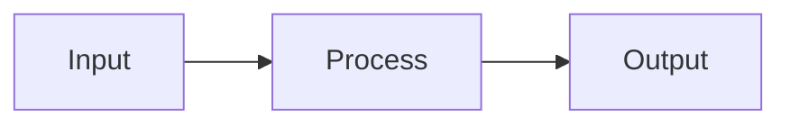

# Carbon Slides

A minimal system for writing presentations in **plain Markdown** and rendering
them as a polished, scrolling slide deck on **GitHub Pages**, styled with IBM's
[Carbon Design System](https://carbondesignsystem.com/) tokens.

## How It Works

```
slides.md  -->  index.html  -->  GitHub Pages
 (you write)     (template)       (renders it)
```

1. You write your slides in `slides.md` using simple Markdown conventions.
2. The `index.html` template fetches that file, splits it on `---` separators,
   and renders each section as a styled slide.
3. GitHub Pages serves it as a beautiful, scrolling presentation.

No build step. No npm install. No static site generator. Just two files.

## Quick Start

1. **Fork or clone this repo.**

2. **Edit `slides.md`** with your own content. Use `---` between slides.

3. **Enable GitHub Pages:**
   - Go to your repo's **Settings > Pages**
   - Under "Source", select **Deploy from a branch**
   - Choose `main` (or `master`) and `/ (root)`
   - Click Save

4. **Visit** `https://YOUR-USERNAME.github.io/YOUR-REPO-NAME/`

That's it. Your slides are live.

## Markdown Conventions

### Slide separators

Use `---` on its own line with blank lines above and below:

```markdown
Content from one slide.

---

## Next Slide Title

Content for the next slide.
```

### Title slide

The first section (before the first `---`) is automatically styled as a
title slide. Use this structure:

```markdown
# Deck Title
### Subtitle

> Presenter Name -- Date
```

### Slide titles

Every slide after the title should start with `## Heading`:

```markdown
---

## My Slide Title

Content goes here.
```

### Key messages / callouts

Use blockquotes for key takeaways:

```markdown
> This is the one thing the audience should remember.
```

### Diagrams

Fenced Mermaid blocks are rendered automatically:

````markdown

````

### Speaker notes

HTML comments are invisible in the rendered output:

```markdown
<!-- NOTES: Pause here and ask the audience a question. -->
```

### Images

Place images in an `images/` folder and reference them:

```markdown


*Figure 1: Caption text.*
```

## What You Get from Carbon

The template applies these Carbon Design System conventions:

- **IBM Plex Sans** and **IBM Plex Mono** fonts via CDN
- **Carbon color tokens** (White theme and Gray 100 dark theme)
- **Carbon spacing scale** (2-4-8 progression)
- **Carbon type scale** (expressive heading hierarchy)
- **Carbon data table styling** on all Markdown tables
- **Carbon blockquote treatment** with blue left border and gray background
- **Dark/light theme toggle** in the nav bar
- **Responsive layout** that works on mobile
- **Print styles** with page-break-inside avoidance

## Customization

### Changing the slides file

Edit the `SLIDES_FILE` constant at the top of the `<script>` in `index.html`:

```javascript
const SLIDES_FILE = 'my-other-talk.md';
```

### Switching to dark theme by default

Add `class="dark-theme"` to the `<html>` tag in `index.html`:

```html
<html lang="en" class="dark-theme">
```

### Multiple decks in one repo

Create multiple `.md` files and multiple `.html` files (or use a query
parameter -- the template is easy to extend):

```
index.html        -->  loads slides.md
other-talk.html   -->  loads other-talk.md
```

## File Structure

```
your-repo/
  index.html      # The rendering template (edit only to customize)
  slides.md       # Your slides (edit this for every new talk)
  images/         # Any images referenced in your slides
    chart.png
    photo.jpg
  README.md       # This file
```

## Browser Support

Works in all modern browsers. Mermaid diagrams require JavaScript.
The presentation degrades gracefully without JS (you just see raw text).

## License

The template is free to use. Carbon Design System and IBM Plex are
open-source under the Apache 2.0 and SIL Open Font licenses respectively.
