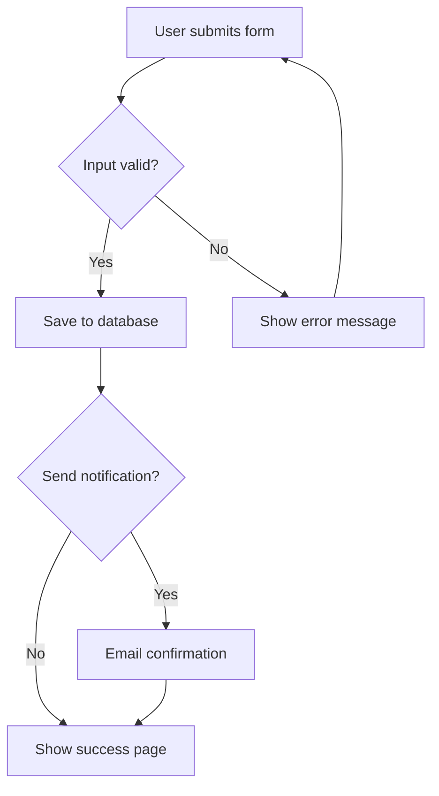
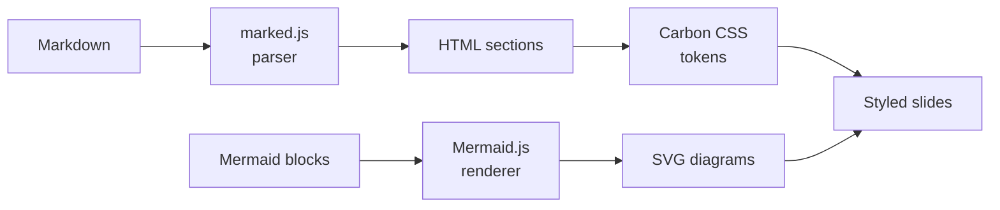
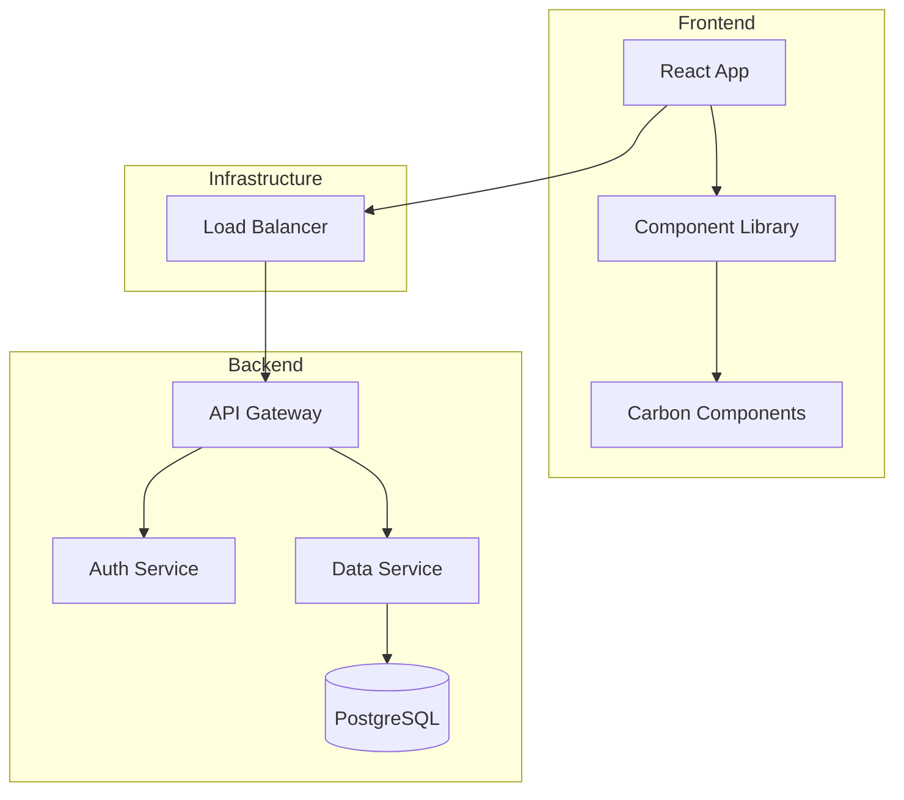
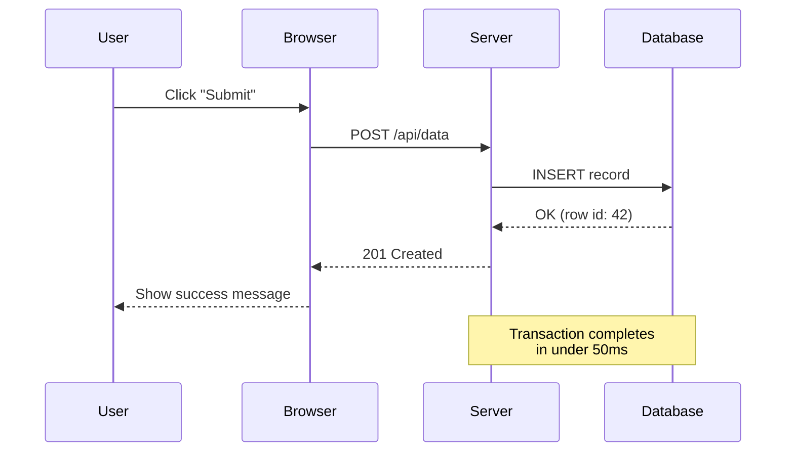
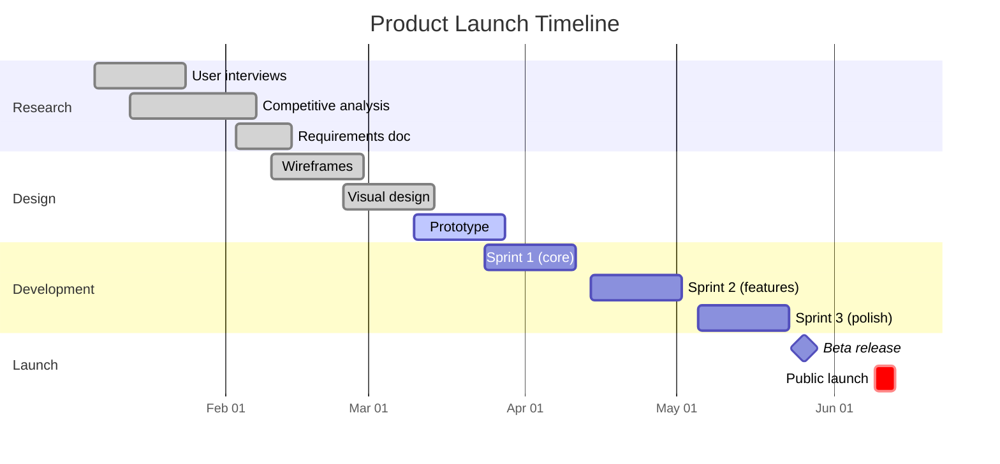
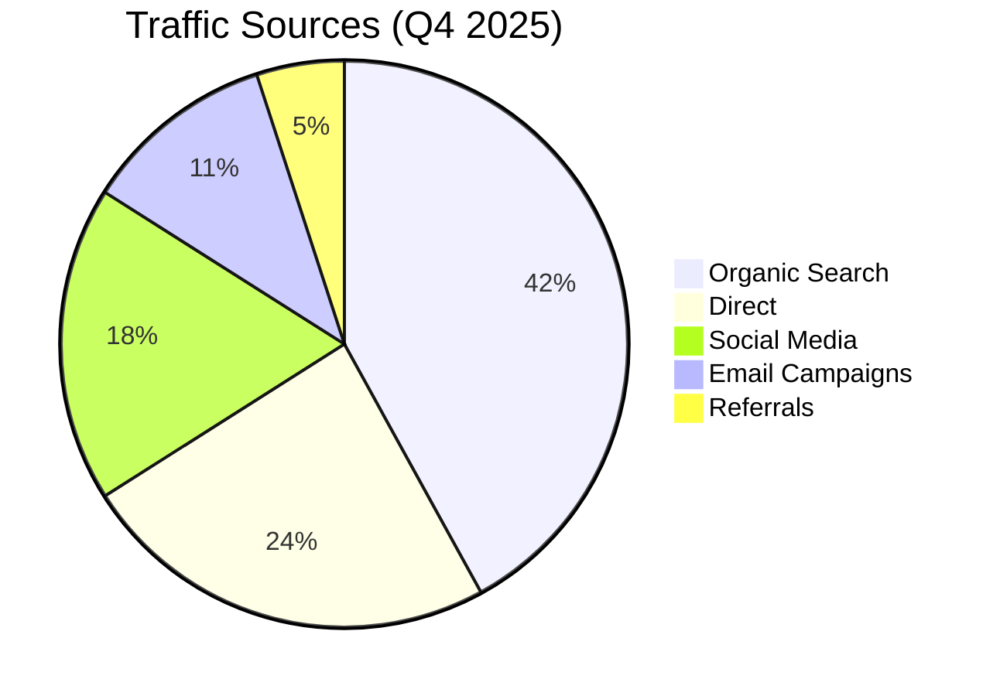
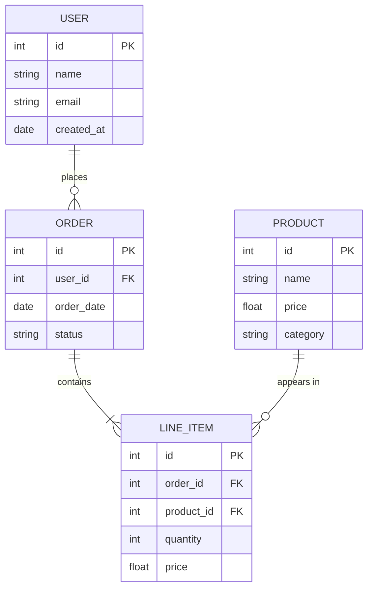
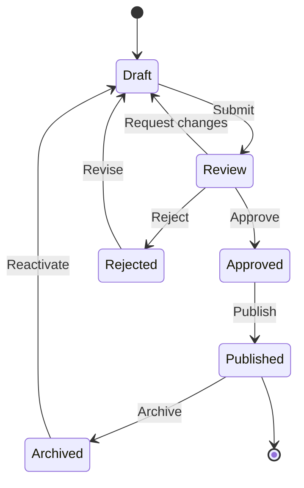
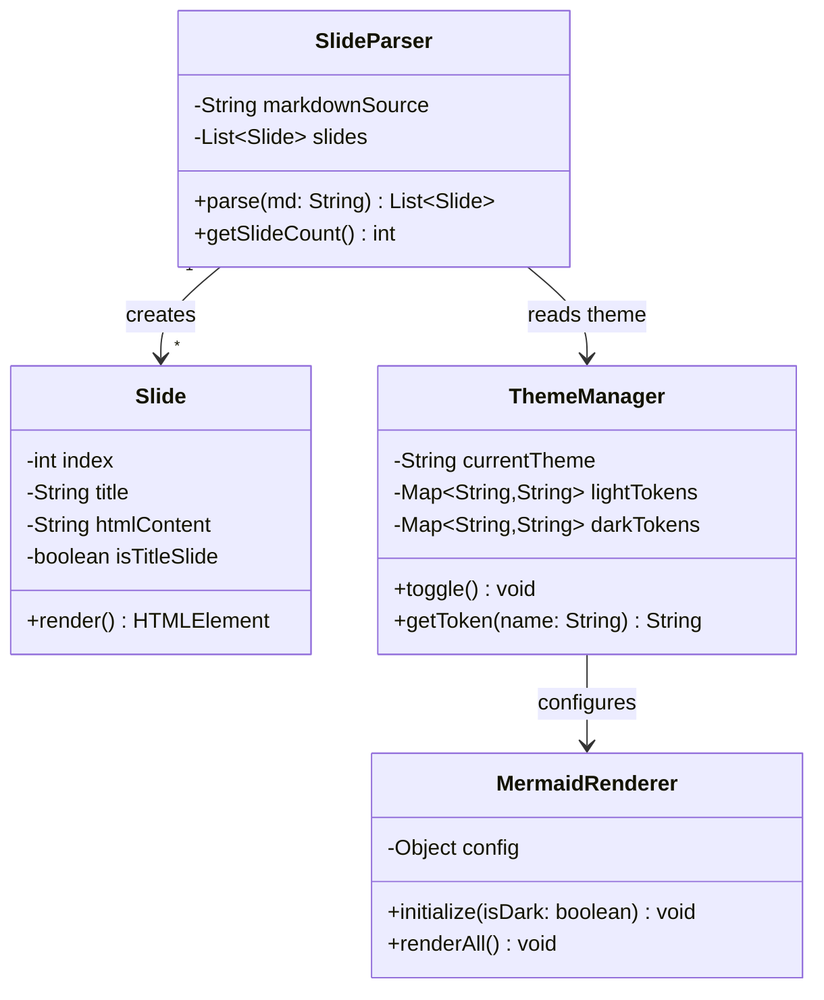
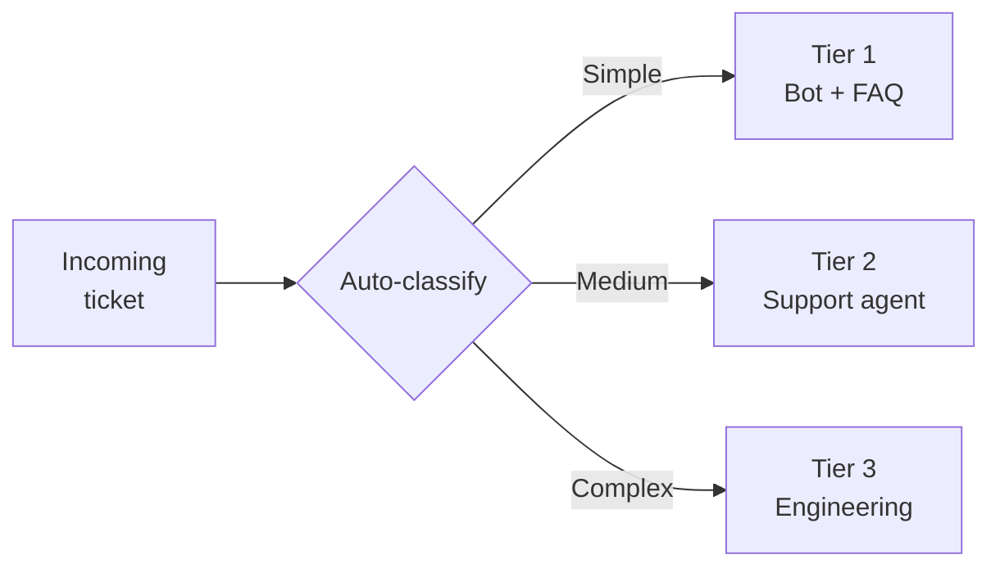

# Carbon Slides Element Showcase
### Every supported Markdown element, rendered with Carbon design tokens

> Jim Weaver -- March 2026

<!-- NOTES: This deck demonstrates every element type the template supports. Use it as a reference when building your own presentations. -->

---

## Agenda

1. Typography and text formatting
2. Lists and nesting
3. Blockquotes and callouts
4. Tables
5. Code blocks
6. Images and captions
7. Mermaid: flowchart
8. Mermaid: sequence diagram
9. Mermaid: Gantt chart
10. Mermaid: pie chart
11. Mermaid: entity-relationship diagram
12. Mermaid: state diagram
13. Mermaid: class diagram
14. Combining elements
15. Speaker notes and links

---

## Typography and Text Formatting

This slide demonstrates the text formatting options available.

Paragraphs are plain body text rendered at 16px in IBM Plex Sans with a line-height of 1.625. They are capped at a 42rem measure for comfortable reading. This is a second sentence in the same paragraph to show how longer text flows.

Use **bold text** to emphasize key terms. Carbon renders bold as semibold (weight 600) rather than the browser default of 700, which gives it a cleaner look.

Use *italic text* for secondary emphasis, attributions, or foreign phrases.

Use `inline code` for technical terms, file names like `slides.md`, commands like `git push`, or variable names like `fontSize`.

You can also combine them: ***bold italic***, **`bold code`**, and *`italic code`* all work.

### This is a sub-heading

Sub-headings within a slide use `###` and render at 20px with weight 600. Use them sparingly to divide a dense slide into two logical sections. Never go deeper than `###` in a slide deck.

---

## Unordered Lists

Simple bullet lists for non-sequential information:

- First item in the list
- Second item with **bold emphasis** on a key phrase
- Third item mentioning a `technical term` inline
- Fourth item with *italic aside*

### Nested unordered lists

- Parent item one
  - Child item A
  - Child item B
    - Grandchild item (three levels deep is the practical limit)
  - Child item C
- Parent item two
  - Child item D

---

## Ordered Lists

Use numbered lists when sequence or ranking matters:

1. First, define the problem clearly
2. Second, gather evidence and data
3. Third, propose a solution
4. Fourth, validate with stakeholders
5. Fifth, implement and measure

### Nested ordered lists

1. Phase one: discovery
   1. Conduct user interviews
   2. Analyze existing data
   3. Map current workflows
2. Phase two: design
   1. Create wireframes
   2. Build prototypes
   3. Run usability tests
3. Phase three: delivery
   1. Develop MVP
   2. Beta testing
   3. Launch

---

## Mixed Lists

You can nest ordered lists inside unordered lists and vice versa:

- Planning considerations
  1. Timeline constraints
  2. Budget limits
  3. Team capacity
- Technical requirements
  1. Performance benchmarks
  2. Accessibility standards
  3. Security compliance
- Open questions
  - Who owns the rollout?
  - What does success look like?

---

## Blockquotes as Callouts

Blockquotes are styled as Carbon callout boxes with a blue left border and gray background.

> This is a single-line callout for a key takeaway or memorable quote.

They work well after presenting evidence, to summarize the point:

> When used at the end of a slide, blockquotes act as a visual anchor. The audience's eye is drawn to the colored border and background shift, making this the thing they remember.

### Blockquotes with formatting

> You can use **bold**, *italic*, and `code` inside blockquotes. Everything renders correctly.

> *Italic blockquotes work well for attributions or editorial asides, like this one.*

---

## Tables: Simple

Tables are styled with Carbon's data table treatment: uppercase headers, hover rows, and consistent spacing.

| Name       | Role             | Location      |
|------------|------------------|---------------|
| Alice Chen | Engineering Lead | San Francisco |
| Bob Patel  | Product Manager  | New York      |
| Carol Wu   | Design Director  | London        |

---

## Tables: Data-Heavy

Tables handle numeric data well. Column alignment follows standard Markdown syntax.

| Quarter | Revenue   | Expenses  | Profit    | Margin |
|---------|----------:|----------:|----------:|-------:|
| Q1 2025 | $2.4M     | $1.8M     | $0.6M     | 25.0%  |
| Q2 2025 | $2.9M     | $1.9M     | $1.0M     | 34.5%  |
| Q3 2025 | $3.1M     | $2.0M     | $1.1M     | 35.5%  |
| Q4 2025 | $3.8M     | $2.2M     | $1.6M     | 42.1%  |

> Revenue grew 58% year-over-year, with margins expanding from 25% to 42%.

---

## Tables: Comparison Layout

Use tables as a two-column layout for side-by-side comparisons:

| Before (2023)                  | After (2025)                    |
|--------------------------------|---------------------------------|
| Manual deploys, twice weekly   | Automated CI/CD, on every merge |
| 45-minute rollback process     | 30-second automated rollback    |
| No test coverage tracking      | 94% coverage with dashboard     |
| Incidents discovered by users  | Proactive alerting catches 98%  |
| 4-hour incident response       | 12-minute mean time to resolve  |

---

## Code Blocks: Python

Fenced code blocks render in IBM Plex Mono on a gray background.

```python
def calculate_retention(cohort_data: dict) -> float:
    """Calculate 30-day retention rate for a user cohort."""
    initial_users = cohort_data["day_0"]
    retained_users = cohort_data["day_30"]

    if initial_users == 0:
        return 0.0

    return (retained_users / initial_users) * 100
```

The function above takes a cohort dictionary and returns a percentage. Notice how `inline code` in the surrounding text uses the same monospace font.

---

## Code Blocks: JavaScript

```javascript
async function fetchSlides(url) {
  const response = await fetch(url);
  if (!response.ok) {
    throw new Error(`Failed to load: ${response.status}`);
  }
  const markdown = await response.text();
  return markdown.split(/\n\s*---\s*\n/);
}
```

---

## Code Blocks: Shell Commands

```bash
# Clone the repo and start presenting
git clone https://github.com/yourname/your-slides.git
cd your-slides

# Edit your slides
vim slides.md

# Push to deploy on GitHub Pages
git add slides.md
git commit -m "Update slide deck"
git push origin main
```

---

## Code Blocks: JSON and Config

```json
{
  "name": "carbon-slides",
  "version": "1.0.0",
  "description": "Markdown slides with Carbon design tokens",
  "slides": "slides.md",
  "theme": {
    "light": "white",
    "dark": "gray-100"
  }
}
```

---

## Code Blocks: CSS

```css
.slide h2 {
  font-size: var(--cds-heading-05);
  font-weight: 300;
  line-height: 1.25;
  letter-spacing: 0;
  margin-bottom: var(--cds-spacing-06);
  color: var(--cds-text-primary);
}
```

This is the actual CSS used to style slide titles in this template. The light font weight at large sizes is a hallmark of Carbon's expressive type scale.

---

## Images

Reference images from your repo with standard Markdown syntax:


*Figure 1: System architecture overview. Images are capped at 100% width and centered with Carbon spacing.*

---

## Images with Context

Images work best when surrounded by explanatory text:

The dashboard below shows the key metrics we track weekly. The top row covers acquisition, the bottom row covers retention.


*Figure 2: Weekly metrics dashboard. Replace this placeholder with an actual screenshot from your repo's images folder.*

Note how the caption renders in a smaller size with secondary text color, creating a clear visual distinction from body text.

---

## Mermaid: Flowchart (TD)

Top-down flowcharts for processes and decision trees:



---

## Mermaid: Flowchart (LR)

Left-to-right flowcharts for pipelines and horizontal processes:



---

## Mermaid: Flowchart with Subgraphs

Subgraphs group related nodes into labeled clusters:



---

## Mermaid: Sequence Diagram

Sequence diagrams show interactions between actors over time:



---

## Mermaid: Gantt Chart

Gantt charts for project timelines and phased rollouts:



---

## Mermaid: Pie Chart

Pie charts for proportional data:



> Organic search drives nearly half of all traffic, reinforcing the case for continued SEO investment.

---

## Mermaid: Entity-Relationship Diagram

ER diagrams for data models and database schemas:



---

## Mermaid: State Diagram

State diagrams for modeling lifecycle and status transitions:



---

## Mermaid: Class Diagram

Class diagrams for object-oriented design and API structure:



---

## Combining Elements

The most effective slides combine multiple element types. Here is a realistic example mixing a paragraph, table, diagram, and callout:

Customer support response times have improved dramatically since adopting the tiered routing system.

| Tier     | Avg. Response | Resolution Rate |
|----------|---------------|-----------------|
| Tier 1   | 4 minutes     | 68%             |
| Tier 2   | 22 minutes    | 89%             |
| Tier 3   | 2 hours       | 97%             |



> Auto-classification routes 61% of tickets to Tier 1, where they resolve in under 5 minutes without human intervention.

---

## Links

Standard Markdown links render with Carbon's interactive blue:

- Visit the [Carbon Design System](https://carbondesignsystem.com/) for full documentation
- Browse the [component library on GitHub](https://github.com/carbon-design-system/carbon)
- Read the [typography guidelines](https://carbondesignsystem.com/elements/typography/overview/)

Links also work inline: the IBM Plex typeface is available on [GitHub](https://github.com/IBM/plex) under the SIL Open Font License.

---

## Speaker Notes

This slide has invisible speaker notes embedded as HTML comments. They will not appear in the rendered output, but are visible when editing the Markdown source.

<!-- NOTES: This is a speaker note. Only you can see it in the raw .md file. Use these to remind yourself of talking points, timing cues, or audience questions to anticipate. -->

You can verify this by viewing the raw `slides.md` file -- the notes are there between comment tags.

<!-- NOTES: Another note. You can have multiple comment blocks per slide. Mention the Q3 results here and reference the earlier data table. -->

---

## Element Reference Summary

| Element                | Markdown syntax                      | Carbon treatment                            |
|------------------------|--------------------------------------|---------------------------------------------|
| Deck title             | `# Title`                            | 54px, weight 300, expressive                |
| Subtitle               | `### Subtitle`                       | 28px, weight 300, secondary color           |
| Presenter line         | `> Name -- Date`                     | Blockquote, no border on title slide        |
| Slide title            | `## Title`                           | 32px, weight 300, expressive                |
| Sub-heading            | `### Heading`                        | 20px, weight 600                            |
| Body text              | Plain paragraph                      | 16px, weight 400, 42rem max-width           |
| Bold                   | `**text**`                           | Semibold 600 (not 700)                      |
| Italic                 | `*text*`                             | Standard italic                             |
| Inline code            | `` `code` ``                         | IBM Plex Mono, gray background              |
| Code block             | Triple backtick with lang            | Plex Mono, layer-01 background              |
| Blockquote             | `> text`                             | Blue left border, gray fill                 |
| Unordered list         | `- item`                             | Standard bullets, Carbon spacing            |
| Ordered list           | `1. item`                            | Numbered, Carbon spacing                    |
| Nested list            | Indented `- item`                    | Up to 3 levels supported                    |
| Table                  | Pipe-delimited                       | Carbon data table with hover rows           |
| Image                  | ``                       | Max-width 100%, centered                    |
| Image caption          | `*Caption*` after image              | Smaller size, secondary color               |
| Link                   | `[text](url)`                        | Interactive blue, visited purple            |
| Speaker notes          | `<!-- NOTES: text -->`               | Hidden in rendered output                   |
| Slide separator        | `---`                                | Subtle border between sections              |
| Mermaid flowchart      | `` ```mermaid flowchart``` ``        | Carbon tokens in nodes and edges            |
| Mermaid sequence       | `` ```mermaid sequenceDiagram``` ``  | Carbon colors for actors and messages       |
| Mermaid Gantt          | `` ```mermaid gantt``` ``            | Blue/gray task bars, red for critical       |
| Mermaid pie            | `` ```mermaid pie``` ``              | Proportional segments                       |
| Mermaid ER             | `` ```mermaid erDiagram``` ``        | Carbon node and border colors               |
| Mermaid state          | `` ```mermaid stateDiagram-v2``` ``  | Carbon fills with Carbon connectors         |
| Mermaid class          | `` ```mermaid classDiagram``` ``     | Carbon fills and border styling             |
| Dark theme             | Nav bar toggle button                | All tokens swap to Gray 100 palette         |

---

## Thank You

- GitHub: github.com/jimweaver
- Email: jim@example.com

> Questions?

<!-- NOTES: Open the floor for questions. Have the Element Reference Summary slide ready to scroll back to if anyone asks about a specific element. -->
