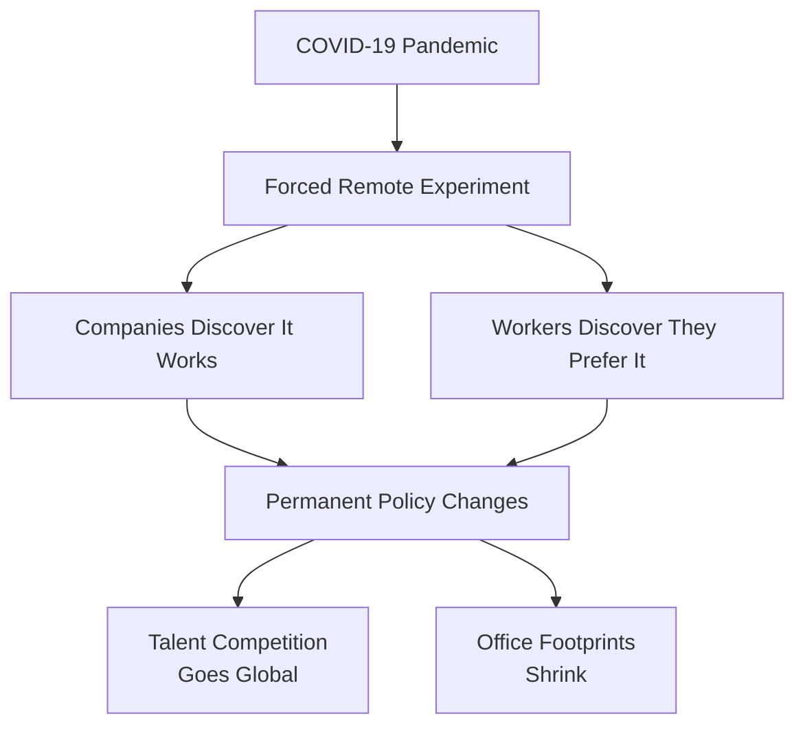
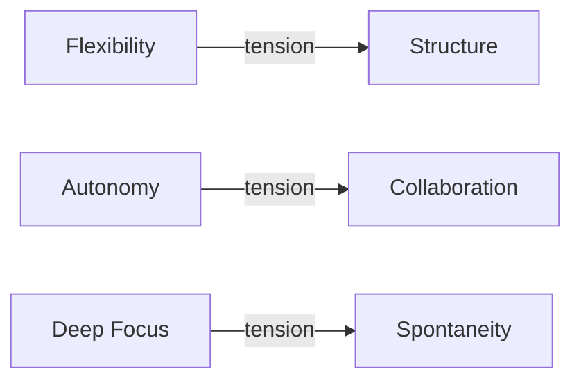
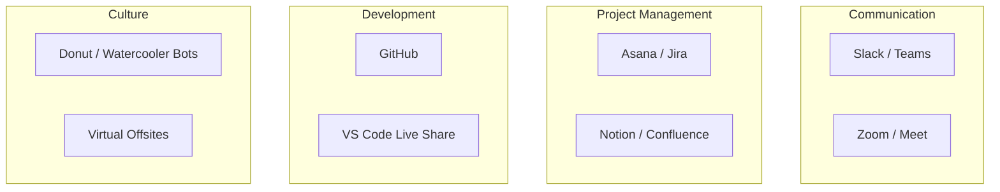
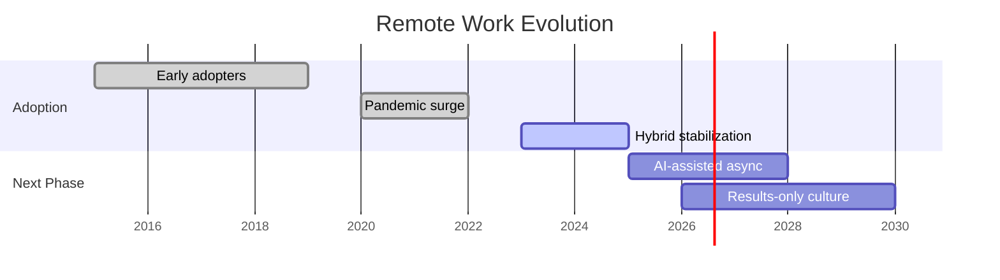

# The Rise of Remote Work
### How distributed teams are reshaping the modern workplace

> Jim Weaver -- March 2026

---

## Agenda

1. The shift in numbers
2. What's driving the change
3. Benefits and tradeoffs
4. Tools that make it work
5. What's next

<!-- NOTES: Welcome the audience. Mention this is a scrolling presentation. -->

---

## The Shift in Numbers

Remote and hybrid work have moved from a temporary experiment to a permanent fixture of the labor market.

| Metric                        | 2019   | 2023   | 2025   |
|-------------------------------|--------|--------|--------|
| % of US workers fully remote  | 5.7%   | 28%    | 22%    |
| % offering hybrid options     | 12%    | 58%    | 67%    |
| Avg. days remote per week     | 0.5    | 2.3    | 2.8    |

> The genie is out of the bottle. Workers have tasted flexibility and they are not giving it back.

---

## What's Driving the Change

The pandemic forced a rapid experiment, but the results are what made the shift stick.

---

## Benefits: The Employee View

- **No commute** -- the average American saves 54 minutes per day
- **Flexibility** -- work when you are most productive
- **Cost savings** -- less spent on gas, lunches, and work clothes
- **Location freedom** -- live where you want, not where the office is

> Workers with remote options report **22% higher job satisfaction** compared to fully in-office peers.

---

## Benefits: The Employer View

The business case is strong across multiple dimensions.

| Role Type         | Productivity Change |
|-------------------|---------------------|
| Software Dev      | +13%                |
| Customer Support  | +9%                 |
| Sales             | +2%                 |
| Creative/Design   | -3% to +5%         |

### Cost impact

- Talent pool expands from a metro area to the entire world
- Office space costs drop by 30-50%
- Employee retention improves with attrition dropping roughly 35%

---

## The Tradeoffs

Not everything is better. Honest challenges include:

- **Isolation** -- loneliness is the top complaint among remote workers
- **Collaboration friction** -- spontaneous hallway conversations disappear
- **Onboarding difficulty** -- new hires take longer to ramp up
- **Work-life blur** -- "always on" culture can creep in without boundaries

---

## Tools That Make It Work

> The right stack is not about having more tools. It is about having fewer tools that everyone actually uses.

---

## A Day in the Life: Hybrid Schedule

| Time        | Activity                         |
|-------------|----------------------------------|
| 8:00 AM     | Async check-in on Slack          |
| 8:30 AM     | Deep work block (no meetings)    |
| 11:00 AM    | Team standup (video)             |
| 11:30 AM    | Collaborative session            |
| 12:30 PM    | Lunch break                      |
| 1:30 PM     | Focus work                       |
| 3:00 PM     | Cross-team sync                  |
| 3:30 PM     | Wrap-up, plan tomorrow           |

---

## What's Next

Three trends to watch:

1. **AI-powered async** -- tools that summarize meetings you skip, draft replies, and triage your inbox
2. **Results-only work environments** -- no set hours, just deliverables and deadlines
3. **In-person as an event** -- quarterly offsites replace daily office attendance

---

## Key Takeaway

> Remote work is not a perk anymore. It is infrastructure. Companies that treat flexibility as a strategic advantage will attract the best talent over the next decade.

---

## Thank You

- GitHub: github.com/jimweaver
- Email: jim@example.com

> Questions?
